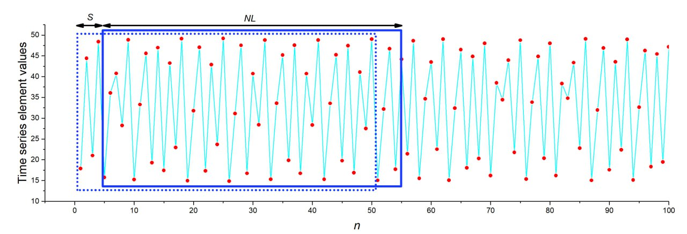

# Time Series Utilities
These utilities allow you to split operations with time series.

## 1. Time series spliter
The program allows you to split the time series according to the specified parameters. 
The parameters are set in the config dictionary:
* fname - file name
* length - time series sample length (NL)
* step - step with which the initial time series is divided (S)

**Result**: Two text files:
 - [fname]_S[step]_NL[length]_index.txt - array with indexes.
 - [fname]_S[step]_NL[length]_series.txt - time series array.